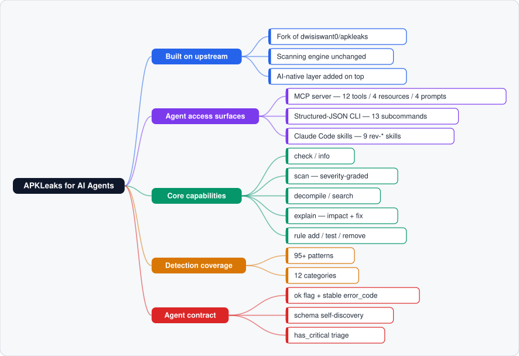

# APKLeaks for AI Agents

**English** | [简体中文](README.zh-CN.md)

[](https://badge.fury.io/gh/dwisiswant0%2fapkleaks.svg)
[](https://github.com/dwisiswant0/apkleaks/issues)

An **AI-agent-native** fork of [APKLeaks](https://github.com/dwisiswant0/apkleaks). It finds secrets, API keys, tokens, and endpoints inside Android APKs — but where the original is a tool a human runs at a terminal, this fork is a tool an **AI agent operates**. Every surface speaks JSON, self-describes in one call, and grades its own findings, so an agent (Claude Code or any shell-capable runtime) can drive a full security audit without ever parsing prose.

It ships in one repository as three things at once: an **MCP server**, a **structured-JSON CLI**, and a **Claude Code plugin** that registers nine reverse-engineering **skills**.

> [!IMPORTANT]
> This fork is meant to be *consumed by an agent, not typed by a human.* Responses are deterministic and machine-readable; the tool advertises its whole API through a single `schema` call; findings arrive pre-sorted by severity with a `has_critical` flag for one-branch triage. If you want the classic interactive CLI, jump to [Standalone human usage](#standalone-human-usage).

### Feature tree at a glance

A fork of upstream APKLeaks, re-architected as an AI-native toolkit. One picture over a thousand words — every access surface, capability, and skill in a single view. The figure below is rendered by [`tools/feature_tree.py`](tools/feature_tree.py) (pure standard library, no Mermaid/Graphviz) and committed as a plain SVG, so it shows up in any Markdown viewer:



<details>
<summary>Text version (always renders)</summary>

```text
APKLeaks for AI Agents
├─ Built on upstream
│  ├─ Fork of dwisiswant0/apkleaks
│  ├─ Scanning engine unchanged
│  └─ AI-native layer added on top
├─ Agent access surfaces
│  ├─ MCP server — 12 tools / 4 resources / 4 prompts
│  ├─ Structured-JSON CLI — 13 subcommands
│  └─ Claude Code skills — 9 rev-* skills
├─ Core capabilities
│  ├─ check / info
│  ├─ scan — severity-graded
│  ├─ decompile / search
│  ├─ explain — impact + fix
│  └─ rule add / test / remove
├─ Detection coverage
│  ├─ 95+ patterns
│  └─ 12 categories
└─ Agent contract
   ├─ ok flag + stable error_code
   ├─ schema self-discovery
   └─ has_critical triage
```

Regenerate with `python3 tools/feature_tree.py` (writes `docs/feature-tree.svg` and prints this tree).

</details>

### Contents

- [Why this fork exists](#why-this-fork-exists)
- [How an agent uses it](#how-an-agent-uses-it)
  - [1. MCP server — native tool calls](#1-mcp-server--native-tool-calls)
  - [2. Structured-JSON CLI — any shell](#2-structured-json-cli--any-shell)
  - [3. Claude Code skills — by intent](#3-claude-code-skills--by-intent)
  - [A typical agent loop](#a-typical-agent-loop)
- [The agent contract](#the-agent-contract)
- [Capability reference](#capability-reference)
  - [AI-CLI subcommands](#ai-cli-subcommands)
  - [MCP tools](#mcp-tools)
  - [MCP resources](#mcp-resources)
  - [MCP prompts](#mcp-prompts)
- [Skills catalog](#skills-catalog)
- [Repository layout](#repository-layout)
- [Setup — install the plugin](#setup--install-the-plugin)
- [Detection coverage](#detection-coverage)
- [Standalone human usage](#standalone-human-usage)
- [License](#license)
- [Acknowledgments](#acknowledgments)

---

## Why this fork exists

Upstream APKLeaks is a good human CLI: point it at an `.apk`, read a text report. That contract falls apart the moment the *operator is an LLM*. An agent can't reliably scrape a colored stdout dump, can't discover what flags exist without reading source, and can't branch its plan on a sentence. It needs structured I/O, stable error codes, and a way to call the tool as a first-class function.

So this fork wraps the original engine — **without touching the scanning logic** — in a layer built for that operator:

- **Deterministic JSON on every surface.** Each call returns `{"ok": true, "data": …}` or `{"ok": false, "error_code": …}`. Nothing to parse, nothing to guess.
- **One-call self-discovery.** A single `schema` request returns every subcommand, flag, and return shape — the agent learns the whole API without opening a file.
- **Severity-graded findings.** Results come pre-classified `critical → high → medium → low → info` with a `has_critical` flag, so the agent triages and filters (`-s critical`) instead of re-reading everything.
- **Native tool calls.** A full MCP server exposes the engine to Claude Code with no Bash subprocess in between.
- **Drop-in skills.** Nine reverse-engineering skills the agent invokes by name, each chaining cleanly into the next.

## How an agent uses it

There are three integration surfaces over the *same* engine and the *same* JSON envelope — so a workflow written against one ports to the others unchanged. An agent picks whichever its runtime makes cheapest:

| Your agent runtime | Surface to use | Why |
|---|---|---|
| Claude Code with MCP configured | **MCP tools** (`apkleaks_*`) | Native tool calls, no subprocess, typed schemas |
| Any agent that can run a shell | **Structured-JSON CLI** | Zero setup — call via Bash, parse stdout |
| A Claude Code session driven by intent | **`/rev-apkleaks` skill** | Orchestrates the right calls for you |

Start with whichever needs the least wiring; the response shape is identical across all three.

### 1. MCP server — native tool calls

The preferred surface for Claude Code. The agent calls `apkleaks_*` tools directly over the [Model Context Protocol](https://modelcontextprotocol.io/) (stdio) — no Bash, no stdout parsing.

```jsonc
// the agent calls a tool like this (conceptually):
apkleaks_scan({ "file": "/path/app.apk", "severity": "critical" })
// → { "ok": true, "data": { "has_critical": true, "findings": [ ... ] } }
```

Install the plugin (below) and the server is registered automatically — or wire it into `.claude/settings.json` by hand (see [Setup](#setup--install-the-plugin)).

### 2. Structured-JSON CLI — any shell

For any agent that can run shell commands. Invoke `apkleaks-ai-cli.py <subcommand>` via the Bash tool and parse the JSON from stdout — no MCP, no plugin, no config.

```bash
python3 apkleaks-ai-cli.py schema                       # discover all capabilities
python3 apkleaks-ai-cli.py scan -f app.apk -s critical  # triage critical findings only
python3 apkleaks-ai-cli.py explain -c AWS_API_Key       # impact + remediation for a category
```

Every call prints the same envelope on stdout — here is a real `version` response:

```json
{
  "ok": true,
  "timestamp": "2026-06-24T14:02:03+0800",
  "data": { "version": "1.0.0", "python": "3.12.3" }
}
```

### 3. Claude Code skills — by intent

The repo root **is itself an Agent Skill** — a `SKILL.md` (`name: apkleaks`) sits at the top level with the scanner and rules beside it, so dropping the repo into any agent's skills directory (`.claude/skills/apkleaks/`, `~/.claude/skills/`, or a zipped upload) makes it a drop-in skill. It is **also** an installable Claude Code plugin: once installed (see [Setup](#setup--install-the-plugin)), the bundled MCP server plus the nine companion `rev-*` skills — auto-discovered from `skills/` — become available in any session and trigger by intent (e.g. `/rev-apkleaks`), orchestrating the right CLI/MCP calls for the agent. See the [Skills catalog](#skills-catalog).

### A typical agent loop

A full audit is just a few chained calls, each branching on the previous response:

```text
schema            → learn every capability & return shape (once, up front)
check  -f app.apk → confirm jadx + pyaxmlparser present, APK is valid   (branch on ok)
info   -f app.apk → package, SDK levels, categorized permissions        (no decompile)
scan   -f app.apk -s high   → decompile + 95-pattern scan, high+ only    (branch on has_critical)
explain -c <category>       → impact + remediation for each finding      (one per category)
search -d <dir> -p <regex>  → pivot into decompiled source for context   (verify a hit)
```

Because every step returns `ok` and a stable `error_code`, the agent never reads prose to decide what to do next.

## The agent contract

Everything an agent consumes follows one predictable shape.

**Response envelope** — every subcommand and tool returns one of:

```json
{"ok": true,  "timestamp": "ISO-8601", "duration_ms": 123, "data": { /* result */ }}
{"ok": false, "timestamp": "ISO-8601", "error": "human text", "error_code": "FILE_NOT_FOUND"}
```

- **`ok`** — the single boolean to branch on. `error_code` is stable and machine-matchable (`FILE_NOT_FOUND`, `INVALID_APK`, `NO_FINDINGS`, …) and may also appear on a successful call (e.g. `NO_FINDINGS`).
- **`data`** — the payload. For `scan` it carries a `has_critical` flag and findings sorted `critical → info`.
- **`duration_ms`** — so the agent can report timing back to the user.

**Self-discovery** — call `schema` (CLI) or `apkleaks_schema` (MCP) first; one round-trip yields every subcommand, flag, and return shape, so nothing requires reading source.

**Severity & token economy** — findings are pre-graded. Filter with `-s critical` (CLI) / `severity` (MCP) to keep only what matters and minimize tokens spent reading results.

**Worked example** — after a scan surfaces a category, one `explain` call returns the severity, impact, and remediation an agent can act on directly (real output):

```jsonc
// python3 apkleaks-ai-cli.py explain -c Anthropic_API_Key
{
  "ok": true,
  "data": {
    "category": "Anthropic_API_Key",
    "severity": "critical",
    "description": "Anthropic API keys (sk-ant-api03- prefix) provide access to Claude ... Revoke at console.anthropic.com.",
    "impact": "Immediate credential compromise. Rotate and revoke exposed secrets without delay.",
    "remediation": "Rotate the exposed credential immediately. Move secrets to environment variables or a secrets manager. Audit access logs for unauthorized use."
  }
}
```

`explain` accepts partial / case-insensitive category names, so an agent can pass a finding name straight from `scan` output without normalizing it first.

## Capability reference

### AI-CLI subcommands

`python3 apkleaks-ai-cli.py <subcommand>` — 13 subcommands, all returning the JSON envelope above.

| Subcommand | Purpose | Key flags |
|-----------|---------|-----------|
| `schema` | Self-describe every capability (agent discovery) | — |
| `version` | Tool / Python version | — |
| `check` | Verify prerequisites + APK validity (structured error codes) | `-f` |
| `info` | APK metadata + auto-categorized permissions (no decompile) | `-f` |
| `scan` | Full scan: decompile + regex + severity (sorted, `has_critical`) | `-f`, `-s`, `-p`, `-a`, `--json` |
| `patterns` | List detection patterns with severity | `-v` |
| `decompile` | Decompile APK to Java source (returns file count + duration) | `-f`, `-o`, `-a` |
| `search` | Regex-search decompiled source, with file-type filter + context | `-d`, `-p`, `-t`, `-c`, `-l` |
| `explain` | Explain a finding category (impact + remediation) | `-c` |
| `rule-add` | Add a custom detection rule at runtime (in-memory) | `-n`, `-r`, `-s` |
| `rule-remove` | Remove a runtime-added rule | `-n` |
| `rule-test` | Validate a regex against sample text before adding | `-r`, `-t` |
| `mcp` | Run as an MCP server over stdio | — |

> [!NOTE]
> `rule-add` / `rule-remove` mutate an **in-memory** ruleset, so changes persist only within a single long-running process — i.e. a live MCP session. Across separate one-shot CLI invocations the ruleset resets.

### MCP tools

`tools/list` returns 12 tool definitions with rich JSON Schema (descriptions, enums, defaults). The MCP server uses **lazy imports** — `initialize` / `ping` / `tools/list` work even without `pyaxmlparser` installed; only actual scan/info/decompile calls need the dependency.

| Tool | Description | Key parameters |
|------|-------------|----------------|
| `apkleaks_schema` | Discover all capabilities | — |
| `apkleaks_version` | Version info | — |
| `apkleaks_check` | Verify prerequisites + APK validity | `file` |
| `apkleaks_info` | APK metadata (no decompile) | `file` |
| `apkleaks_scan` | Full scan with severity classification | `file`, `severity`, `pattern`, `jadx_args`, `output`, `json_output` |
| `apkleaks_patterns` | List regex detection patterns | `verbose` |
| `apkleaks_decompile` | Decompile to Java source | `file`, `output_dir`, `jadx_args` |
| `apkleaks_search` | Search decompiled source | `dir`, `pattern`, `type`, `context`, `limit` |
| `apkleaks_explain` | Explain a finding category | `category` |
| `apkleaks_rule_add` | Add a custom detection rule (runtime) | `name`, `regex`, `severity` |
| `apkleaks_rule_remove` | Remove a runtime-added rule | `name` |
| `apkleaks_rule_test` | Test a regex against sample text | `regex`, `sample`, `name`, `severity` |

### MCP resources

`resources/list` exposes config + a dynamic source reader; `resources/read` returns the content.

| URI | Description | MIME |
|-----|-------------|------|
| `apkleaks:///config/regexes` | All 95+ regex pattern definitions | application/json |
| `apkleaks:///config/severity-map` | Category → severity mapping | application/json |
| `apkleaks:///config/explanations` | Per-category impact + remediation | application/json |
| `apkleaks:///source/{path}` | Read any decompiled source file (dynamic) | auto-detected |

### MCP prompts

`prompts/list` returns 4 parameterized analysis templates an agent can expand into a full workflow.

| Prompt | Description | Arguments |
|--------|-------------|-----------|
| `security-audit` | Full security audit with remediation | `apk_path`, `severity_filter` |
| `credential-rotation` | Credential rotation plan | `apk_path` |
| `api-inventory` | API endpoint catalog | `apk_path` |
| `permission-risk` | Permission risk assessment | `apk_path` |

## Skills catalog

Nine `rev-*` skills under `skills/`, auto-discovered when the plugin is installed. `rev-apkleaks` drives this tool; the rest cover the adjacent reverse-engineering tasks an agent commonly chains with it.

Each skill uses **progressive disclosure**: a lean `SKILL.md` loads on trigger (mode selection, the core workflow, the contract, hard rules), and a separate `references/reference.md` is read only when the agent needs full detail (every subcommand flag, the complete MCP lifecycle, the resource/prompt catalog, all error codes) — keeping always-on context small while full depth stays one read away.

| Skill | Invoke | What it does |
|-------|--------|--------------|
| **rev-apkleaks** | `/rev-apkleaks` | Scan an APK for secrets, keys, tokens & endpoints (CLI + MCP). |
| **rev-dex-dumper** | `/rev-dex-dumper` | Dump / disassemble DEX — class defs, method signatures, bytecode. |
| **rev-frida** | `/rev-frida` | Dynamic instrumentation: hooking, tracing, SSL-pinning / root-detection bypass. |
| **rev-idapython** | `/rev-idapython` | IDA Pro Python scripting for automated binary analysis. |
| **rev-ios-dump** | `/rev-ios-dump` | Dump / decrypt iOS apps (IPA) from a jailbroken device. |
| **rev-struct** | `/rev-struct` | Reconstruct struct/class layouts and field offsets from access patterns. |
| **rev-symbol** | `/rev-symbol` | Symbol table extraction, import/export & library-function analysis. |
| **rev-u3d-dump** | `/rev-u3d-dump` | Extract Unity3D assets (Assembly-CSharp.dll, bundles, shaders). |
| **rev-unicorn-debug** | `/rev-unicorn-debug` | Emulate / debug CPU instructions via Unicorn (ARM/x86/MIPS…). |

## Repository layout

The repo is laid out as a **Claude Code plugin and skills collection** (the same shape as `anthropics/skills`), so it is installable as a marketplace plugin *and* droppable as a single skill. The defining top-level marker is **`plugin.json`** — not a root `SKILL.md`.

```text
apkleaks-skills/
├── plugin.json                 # top-level plugin manifest (metadata + MCP server)
├── .claude-plugin/
│   ├── plugin.json             # bundled-plugin manifest (uses ${CLAUDE_PLUGIN_ROOT})
│   └── marketplace.json        # marketplace listing (source: "./") — /plugin marketplace add-able
├── skills/                     # 9 auto-discovered rev-* skills
│   └── rev-apkleaks/
│       ├── SKILL.md            # lean entry point (loads on trigger)
│       ├── references/
│       │   └── reference.md    # deep reference (read on demand)
│       └── LICENSE.txt         # Apache-2.0, mirrors root LICENSE
├── SKILL.md                    # optional root skill — repo also works as one drop-in skill
├── references/reference.md     # its on-demand deep reference
├── apkleaks-ai-cli.py          # AI-CLI: 13 subcommands + MCP server (the agent entry point)
├── apkleaks.py                 # original human CLI entry point
├── apkleaks/                   # core engine (decompile, scan, extract — unchanged logic)
├── config/regexes.json         # 95+ detection patterns across 12 categories
├── LICENSE                     # Apache-2.0
└── THIRD_PARTY_NOTICES.md      # attribution for bundled / derived dependencies
```

Every `skills/<name>/` directory follows the canonical Agent Skill anatomy — `SKILL.md` + `references/reference.md` + `LICENSE.txt`. `SKILL.md` frontmatter carries only the spec-sanctioned `name` and `description`. Validate the manifests at any time with `claude plugin validate .`.

## Setup — install the plugin

This isn't "install to scan by hand" — it's wiring the tool into an agent's runtime.

**Prerequisites the agent's environment needs:**

- Python ≥ 3.8
- [`jadx`](https://github.com/skylot/jadx) — auto-downloaded on first decompile if missing
- `pyaxmlparser ≥ 0.3.24` — only for `scan` / `info` / `decompile` (MCP lifecycle works without it)
- [`uv`](https://docs.astral.sh/uv/) — used by the bundled MCP server to auto-provision deps (`curl -LsSf https://astral.sh/uv/install.sh | sh`)

### Recommended: install as a Claude Code plugin

The repo ships a `.claude-plugin/` manifest, so Claude Code can install it as a marketplace plugin. This registers all 9 `rev-*` skills **and** the `apkleaks` MCP server in one step — no manual `settings.json` editing:

```text
/plugin marketplace add android-security-engineer/apkleaks-skills
/plugin install apkleaks
```

The MCP server launches via `uv` from the plugin's install directory (the manifest uses `${CLAUDE_PLUGIN_ROOT}` so the path resolves wherever the plugin lands). Skills are auto-discovered from `skills/` — no further wiring.

### Alternative: wire the MCP server manually

For local development on this repo, or runtimes that don't support plugins, add the MCP server to your project's `.claude/settings.json` directly — pick a runtime; all three are supported:

#### Option 1: `uv run` (recommended)

Auto-installs dependencies into an isolated venv. No manual `pip install`.

```json
{
  "mcpServers": {
    "apkleaks": {
      "command": "uv",
      "args": ["run", "--directory", ".", "python3", "apkleaks-ai-cli.py", "mcp"]
    }
  }
}
```

Install uv: `curl -LsSf https://astral.sh/uv/install.sh | sh`

#### Option 2: `pipx run`

Temporary venv + deps; good for non-uv users.

```json
{
  "mcpServers": {
    "apkleaks": {
      "command": "pipx",
      "args": ["run", "--directory", ".", "python3", "apkleaks-ai-cli.py", "mcp"]
    }
  }
}
```

Install pipx: `pip install pipx` or `brew install pipx`

#### Option 3: `python3` (manual)

Direct execution; requires `pip install -e .` (or `pip install -r requirements.txt`) first.

```json
{
  "mcpServers": {
    "apkleaks": {
      "command": "python3",
      "args": ["apkleaks-ai-cli.py", "mcp"]
    }
  }
}
```

Drop the config into your project's `.claude/settings.json` and Claude Code starts the MCP server automatically when the project opens. (The CLI surface needs no setup — the agent just calls it via Bash.)

## Batch scan (F-Droid → threaded scan → dashboard)

For bulk research on **authorized / open-source** APKs:

```bash
# 1) Download N APKs from the official F-Droid repo
python3 tools/fdroid_download.py -n 100 -o apks

# 2) Scan them in parallel (progress bar + results/status.json logs)
pip install -r requirements.txt
python3 tools/batch_scan.py -d apks -t 4 -o results -s high

# 3) Serve live status for the website dashboard
python3 tools/dashboard_server.py   # http://127.0.0.1:8787/api/status
```

Website route: `/dashboard` (demo data by default; switches to LIVE when the status API is up).

New detection: `AWS_Secret_Access_Key` (matches `aws_secret_access_key = <40-char secret>` style assignments).

## Detection coverage

**95+ regex patterns across 12 categories**, each mapped to a severity and an explanation (impact + remediation):

cloud providers · AI/LLM keys · messaging · payments · DevOps · monitoring · CDN · hosting · identity · private keys · Android-specific · generic.

Agents read the live pattern set via `patterns` (CLI) / `apkleaks_patterns` (MCP) or the `apkleaks:///config/regexes` resource, and extend it at runtime with `rule-add`. Custom static rules can also be supplied to the underlying engine as a JSON file (see [Standalone human usage](#standalone-human-usage)).

## Standalone human usage

The original human CLI still works if you want to run a scan by hand — but for agent use, prefer the surfaces above.

<details>
<summary>Click to expand the classic human CLI</summary>

### Install

```bash
$ pip3 install apkleaks                       # from PyPi
$ docker pull dwisiswant0/apkleaks:latest     # or via Docker
```

### Scan

```bash
$ apkleaks -f ~/path/to/file.apk
# from source
$ python3 apkleaks.py -f ~/path/to/file.apk
# or with Docker
$ docker run -it --rm -v /tmp:/tmp dwisiswant0/apkleaks:latest -f /tmp/file.apk
```

### Options

| Argument | Description | Example |
|----------|-------------|---------|
| `-f, --file` | APK file to scan | `apkleaks -f file.apk` |
| `-o, --output` | Write results to file _(random if not set)_ | `apkleaks -f file.apk -o results.txt` |
| `-p, --pattern` | Path to custom patterns JSON | `apkleaks -f file.apk -p custom-rules.json` |
| `-a, --args` | Disassembler arguments | `apkleaks -f file.apk --args="--deobf --log-level DEBUG"` |
| `--json` | Save as JSON format | `apkleaks -f file.apk -o results.json --json` |

**Custom patterns** — supply your own search rules as JSON via `--pattern /path/to/custom-rules.json`. If omitted, the default [regexes.json](https://github.com/dwisiswant0/apkleaks/blob/master/config/regexes.json) is used.

```json
// custom-rules.json
{ "Amazon AWS Access Key ID": "AKIA[0-9A-Z]{16}" }
```

**Disassembler arguments** — pass jadx args through `-a/--args`, e.g. `--args="--threads-count 5"`.

> [!WARNING]
> Mind the default disassembler arguments to prevent collisions.

</details>

## License

`apkleaks` is distributed under the **Apache License 2.0** — see [`LICENSE`](LICENSE). Bundled and derived components (jadx, dex2jar, pyaxmlparser, LinkFinder, gf, truffleHogRegexes, and the upstream APKLeaks engine) carry their own licenses; full attribution is in [`THIRD_PARTY_NOTICES.md`](THIRD_PARTY_NOTICES.md).

## Acknowledgments

Built on top of [dwisiswant0/apkleaks](https://github.com/dwisiswant0/apkleaks) and the work of many contributors:

- [@ndelphit](https://github.com/ndelphit) — for the inspiring `apkurlgrep` that sparked this tool.
- [@dxa4481](https://github.com/dxa4481) and the `truffleHogRegexes` contributors.
- [@GerbenJavado](https://github.com/GerbenJavado) & [@Bankde](https://github.com/Bankde) — `LinkFinder` patterns for URLs, endpoints & parameters.
- [@tomnomnom](https://github.com/tomnomnom/gf) — the `gf` patterns.
- [@pxb1988](https://github.com/pxb1988) — the `dex2jar` disassembler.
- [@subho007](https://github.com/ph4r05) — the standalone APK parser.
- `SHA2048#4361` _(Discord)_ — Python3 porting help.
- [@Ry0taK](https://github.com/Ry0taK) — reported an [OS command injection bug](https://github.com/dwisiswant0/apkleaks/security/advisories/GHSA-8434-v7xw-8m9x).
- [@dee__see](https://twitter.com/dee__see) — the `NotKeyHacks` curated token set.
- [All contributors](https://github.com/dwisiswant0/apkleaks/graphs/contributors).
